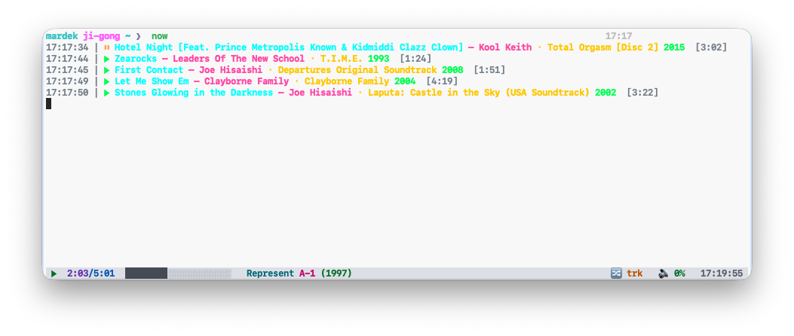

# cmus-now-playing

A zero-dependency Bash script that prints the current playback status of
[cmus](https://cmus.github.io/) (via `cmus-remote -Q`) as a single formatted
line — built for status bars and scripts: **tmux, waybar, polybar, i3blocks,
conky, shell prompts**.

```
▶ Burial - Archangel [2:14/5:09]
```



## Features

- Single portable Bash script, no dependencies beyond `cmus-remote`
- Fully customisable output via format placeholders
- Falls back to the filename when a track has no tags
- Stream-title support for network radio
- Clean exit codes, scriptable and quiet-mode friendly
- Graceful no-op when cmus is not running

## Requirements

- `bash` (4+)
- `cmus` with its remote-control socket available (default setup)

## Installation

```sh
# system-wide
sudo install -Dm755 cmus-now-playing /usr/local/bin/cmus-now-playing

# or user-local
install -Dm755 cmus-now-playing ~/.local/bin/cmus-now-playing
```

> **Note:** for the user-local install, make sure `~/.local/bin` is in your
> `PATH`. Add this to your `~/.bashrc` (or `~/.zshrc`) if needed:
>
> ```sh
> export PATH="$HOME/.local/bin:$PATH"
> ```

## Usage

```
cmus-now-playing [OPTIONS]

  -f, --format FORMAT   output format string (default: "{artist} - {title}")
  -s, --state           print only the player state (playing|paused|stopped)
  -q, --quiet           suppress error messages
  -h, --help            show help
```

### Format placeholders

| Placeholder      | Meaning                                | Example          |
| ---------------- | -------------------------------------- | ---------------- |
| `{state}`        | player state                           | `playing`        |
| `{state_icon}`   | state icon (▶ ⏸ ■)                     | `▶`              |
| `{artist}`       | track artist                           | `Burial`         |
| `{title}`        | track title (falls back to filename)   | `Archangel`      |
| `{album}`        | album name                             | `Untrue`         |
| `{tracknumber}`  | track number                           | `3`              |
| `{date}`         | release date / year                    | `2007`           |
| `{duration}`     | track length, mm:ss                    | `5:09`           |
| `{position}`     | elapsed time, mm:ss                    | `2:14`           |
| `{remaining}`    | time left, mm:ss                       | `2:55`           |
| `{file}`         | full file path                         | `/music/…`       |
| `{stream}`       | stream title (network streams)         | `NTS Radio`      |

### Exit codes

| Code | Meaning                                   |
| ---- | ----------------------------------------- |
| `0`  | cmus is running and a state was reported  |
| `1`  | cmus is not running (cmus-remote failed)  |
| `2`  | invalid arguments                         |

## Examples

```sh
cmus-now-playing
# Burial - Archangel

cmus-now-playing -f '{state_icon} {artist} - {title} [{position}/{duration}]'
# ▶ Burial - Archangel [2:14/5:09]

cmus-now-playing -f '{album} ({date})'
# Untrue (2007)

cmus-now-playing --state
# playing
```

## Status bar integration

**tmux** (`~/.tmux.conf`):

```tmux
set -g status-right '#(cmus-now-playing -f "{state_icon} {artist} - {title}")'
set -g status-interval 5
```

**Waybar** (`~/.config/waybar/config`):

```jsonc
"custom/cmus": {
    "exec": "cmus-now-playing -f '{state_icon} {artist} - {title}'",
    "interval": 2,
    "on-click": "cmus-remote --pause",
    "on-click-right": "cmus-remote --next"
}
```

**Polybar** (`~/.config/polybar/config.ini`):

```ini
[module/cmus]
type = custom/script
exec = cmus-now-playing -f '{state_icon} {artist} - {title}'
interval = 2
click-left = cmus-remote --pause
click-right = cmus-remote --next
```

**Shell prompt / scripts:**

```sh
if now=$(cmus-now-playing -q -f '{state_icon} {title}'); then
    printf 'now playing: %s\n' "$now"
fi
```

## License

BSD 2-Clause — do whatever you want, keep the copyright notice, no warranty.
